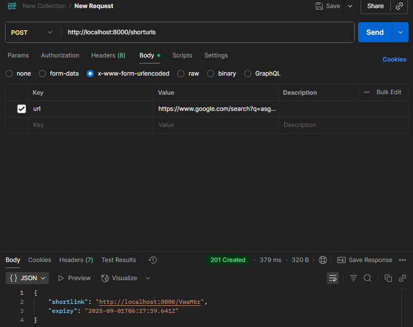
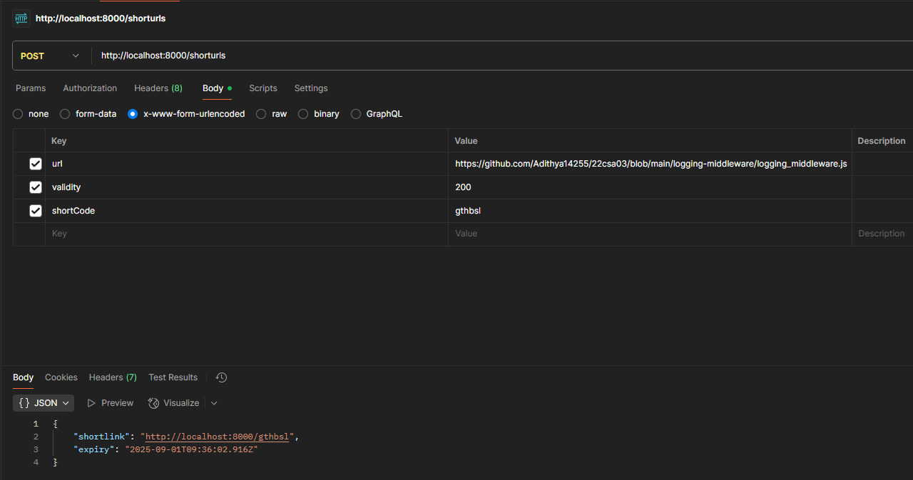
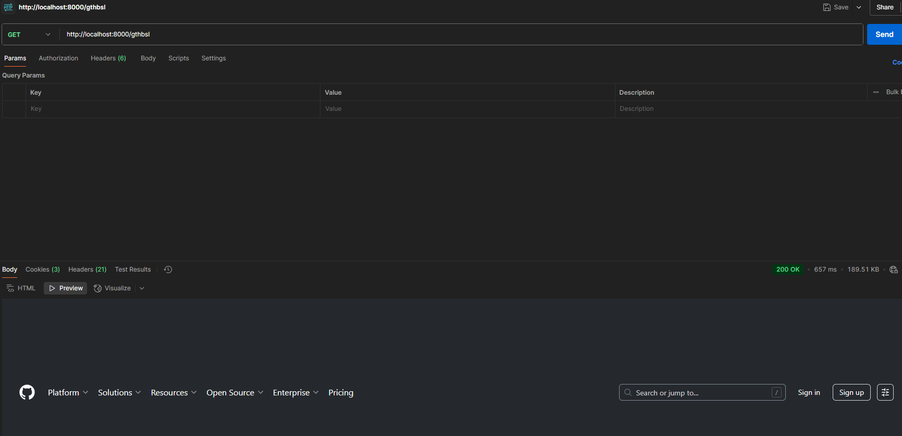

Url shortener 
 - The app works with the logger to log every action
 - shortcode is generated using a basic randomizer function
 - expiry and relevent features have been implemented
 - i wasnt able to complete the statistics part, i ran out of time
 outputs - 

